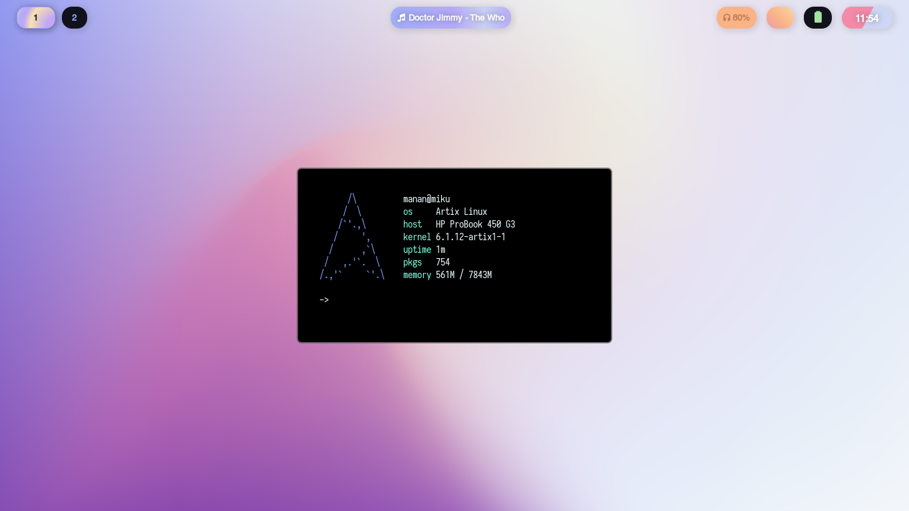

# dotfiles

## Setup
- Operating System: `Artix Linux`
- Application Launcher: `wofi`
- Shell: `bash`
- Terminal Emulator: `kitty`
- Text Editor: `vim`
- Video Player/Music Player/Image Viewer: `mpv`
- Web Browser: `firefox`
- Window Manager: `Hyprland`
- Lock Screen: `swaylock`
