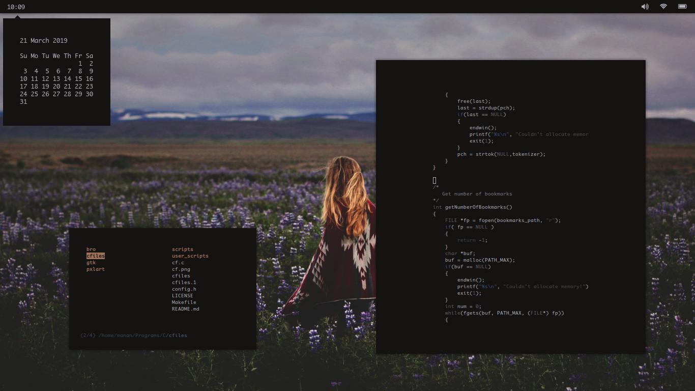
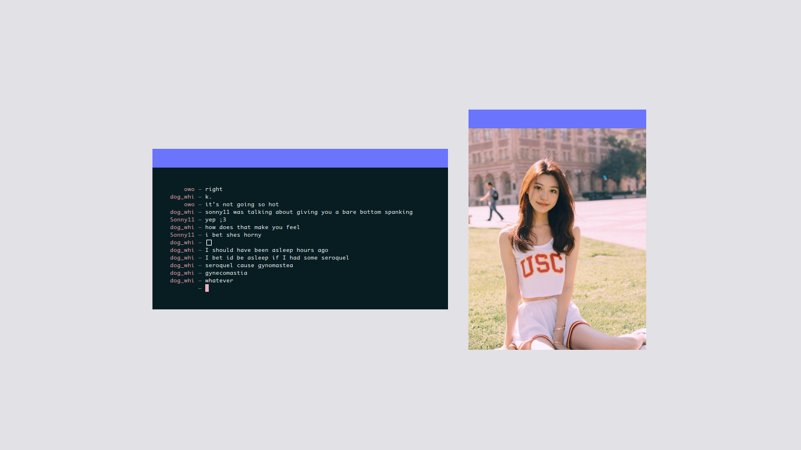

# Manan's Dotfiles
Dotfiles for my Arch Linux setup.

### i3-gaps
[Full Screenshot Album](https://imgur.com/a/ZnjWW)

### openbox
[Full Screenshot Album](https://imgur.com/a/GGf0X)

## Setup
My setup uses [wal](https://github.com/dylanaraps/pywal) to generate Colour Schemes.

- Application Launcher: `rofi`
- Compositor: `compton`
- Icons: `HALO with Pastel Icons`
- Notifications: `dunst`
- Shell: `bash`
- Terminal Emulator: `urxvt`
- Text Editor: `vim`
- Theme: `Lumiere`
- Video Player: `mpv`
- Web Browser: `Firefox`
- Window Manager: `i3-gaps` and `openbox`
- Lock Screen: Modified version of `i3lock-fancy`

## Installation

- Clone the repo: `git clone https://github.com/mananapr/dotfiles.git --depth 1`
- Copy the files to their appropriate directories
