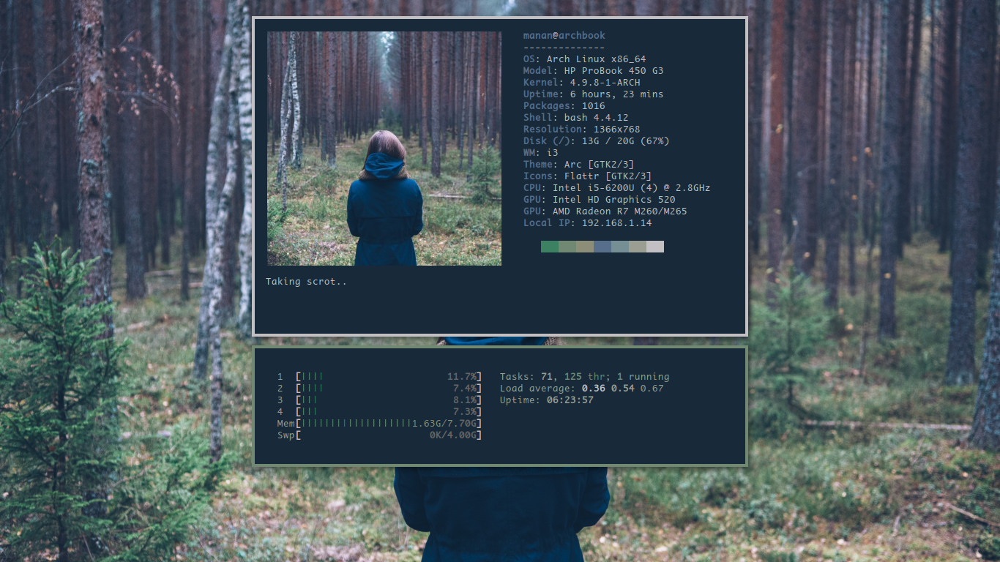

# Manan's Dotfiles
Dotfiles for my Arch Linux setup.

[Full Screenshot Album](http://imgur.com/a/aigQp)

## Setup
My setup uses [wal](https://github.com/dylanaraps/wal) to generate Colour Schemes.

- Application Launcher: `rofi`
- Compositor: `compton`
- Icons: `Flattr`
- Notifications: `dunst`
- Shell: `bash`
- Terminal Emulator: `urxvt`
- Text Editor: `vim`
- Theme: `Arc`
- Video Player: `mpv`
- Web Browser: `Firefox`
- Window Manager: `i3-gaps`
- Lock Screen: `i3lock-fancy`

I also use a tint2 panel which has a fully transparent background and is set on auto-hide.
