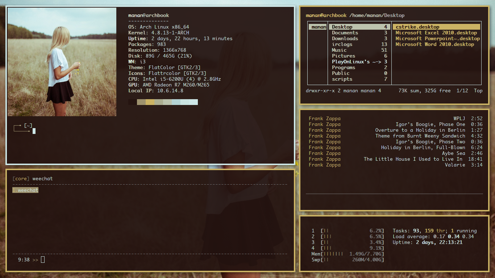
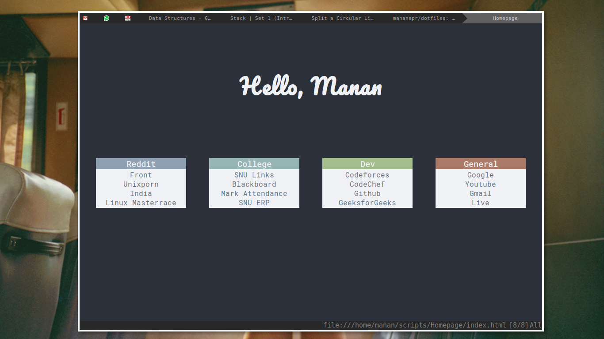
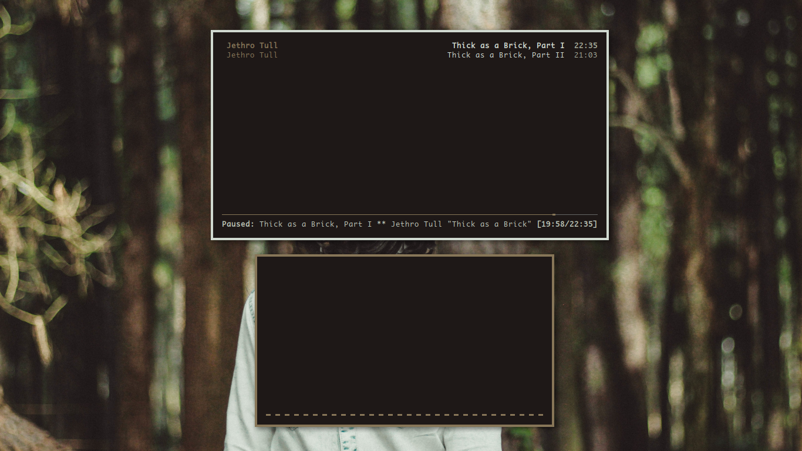
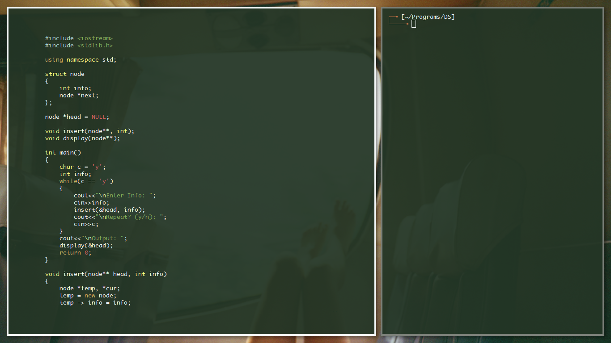
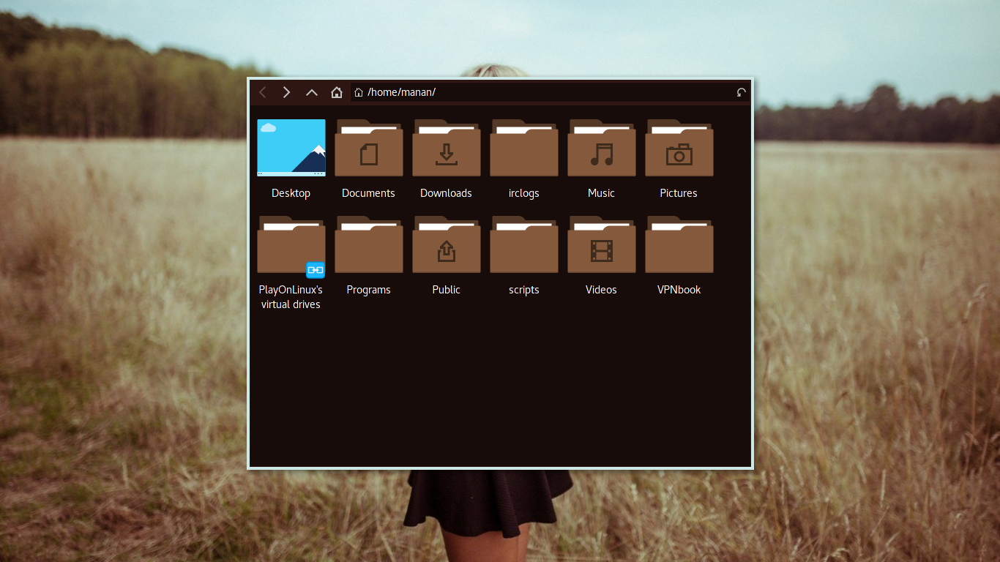

# dotfiles
Dotfiles for my Arch + i3wm setup.

My setup uses [wal](https://github.com/dylanaraps/wal) to generate Colour Schemes.

Firefox with my custom Homepage (included in scripts folder), Vimperator and Twily's CSS

My Music Setup which uses a [custom script](https://www.reddit.com/r/unixporn/comments/3q4y1m/openbox_music_now_with_tmux_and_album_art/?ref=search_posts) to display cover art.

My Vim Setup with Goyo Plugin enabled.

GTK theme generated with [wpgtk](https://github.com/deviantfero/wpgtk).

