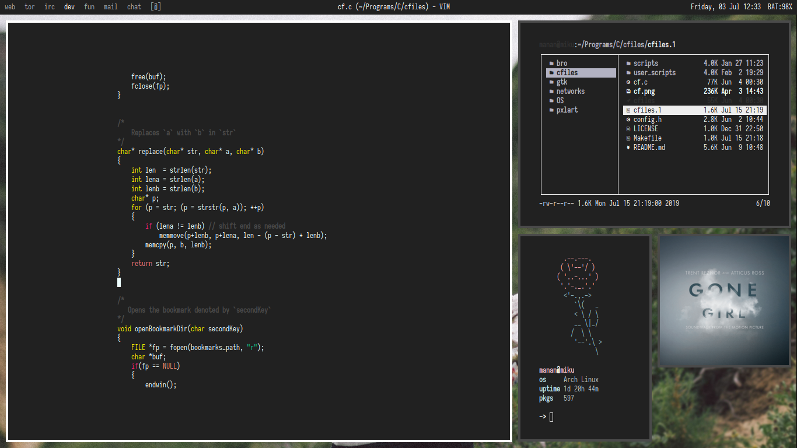

# dotfiles



- Operating System: `Arch Linux`
- Application Launcher: `fuzzel`
- Shell: `bash`
- Terminal Emulator: `kitty`
- Text Editor: `nvim`
- Video Player/Music Player/Image Viewer: `mpv`
- Web Browser: `firefox`, `qutebrowser`
- Window Manager: `niri`
- Lock Screen: `swaylock-effects`

## Setup
```sh
# install nix
sudo pacman -Syu nix
sudo systemctl enable --now nix-daemon.service

# enable flakes
mkdir -p ~/.config/nix
printf 'experimental-features = nix-command flakes\n' > ~/.config/nix/nix.conf

# install yay-bin
git clone https://aur.archlinux.org/yay-bin.git /tmp/yay-bin
cd /tmp/yay-bin
makepkg -si

# install swaylock-effects from AUR
# swaylock-effects in nix is currently broken
yay -S swaylock-effects

# install and setup home-manager
nix run github:nix-community/home-manager -- switch --flake .#manan -b hm-bak
home-manager switch --flake .#manan -b hm-bak
```

### Useful Commands
```sh
# update the flake lock file and apply the new generation
nix flake update
home-manager switch --flake .#manan -b hm-bak

# show the current Home Manager generations:
home-manager generations

# roll back to the previous generation:
home-manager switch --rollback
```
